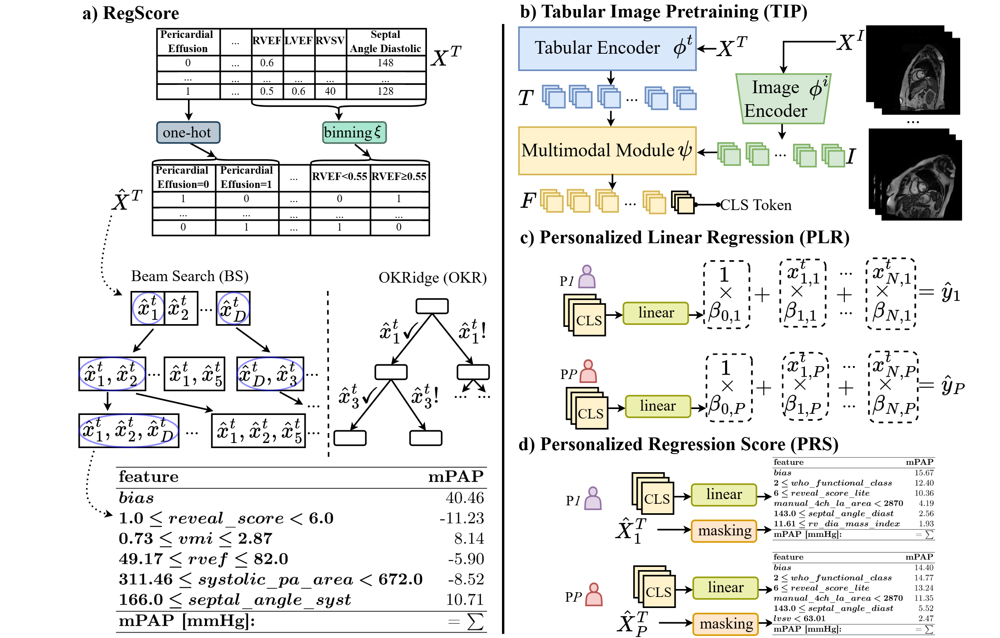

# RegScore

Scoring Systems for Regression Tasks



### Project setup

```sh
cd RegScrore
conda env create --file environment.yaml
conda activate regscore
```

### RegScore

In this repository we provide the code for training RegScore models. To train RegScore on dataset with binary features
run:

```python
from regscore.wrapper import RegScore

rs = RegScore(k=5)
rs.fit(X_binary, y)
rs.print_risk_card(feature_names, X_binary, unit="mmHg")
```

### Personalized Linear Regression (PLR)
To run self-supervised pretraining and training of PLR run:
```python
CUDA_VISIBLE_DEVICES=0 python -u run.py --config-name config_ph_reg_REGSCORE scoring_strategy=personalized_linreg exp_name=plr
```

### Personalized RegScore (PRS)
To run self-supervised pretraining and training of PRS run:
```python
CUDA_VISIBLE_DEVICES=0 python -u run.py --config-name config_ph_reg_REGSCORE scoring_strategy=personalized_regscore exp_name=plr
```

We provide pretrained PLR and PRS
weights [here](https://www.dropbox.com/scl/fi/24fhfztwnep2sv9xpwoc0/plr_best_mae.ckpt?rlkey=8jxdbk7scu4dzfgjxwa2cz0yp&st=021wd5pc&dl=0)
and [here](https://www.dropbox.com/scl/fi/76l7j0enhlbq5xgenxntz/prs_best_mae.ckpt?rlkey=f37tinaj49x2jwx8b31a19ev2&st=1ug0mqur&dl=0).

### Acknowledgements

Our work is based on the following repositories:

* [TIP](https://github.com/siyi-wind/TIP)
* [FasterRisk](https://github.com/interpretml/FasterRisk)
* [MMCL](https://github.com/paulhager/MMCL-Tabular-Imaging)